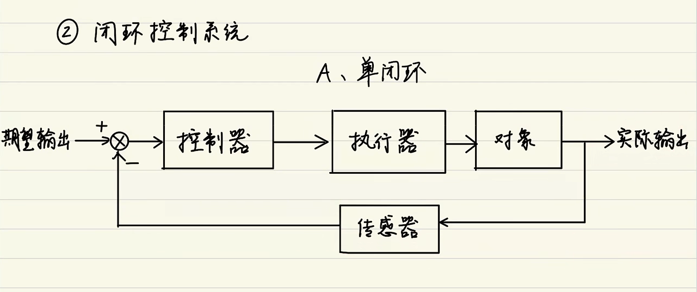

# PID算法

<!-- @import "[TOC]" {cmd="toc" depthFrom=1 depthTo=6 orderedList=false} -->

<!-- code_chunk_output -->

- [PID算法](#pid算法)
  - [1 离散系统的PID算法公式](#1-离散系统的pid算法公式)
    - [1.1 P参数](#11-p参数)
    - [1.2 D参数](#12-d参数)
    - [1.3 I参数](#13-i参数)

<!-- /code_chunk_output -->

---

## 1 离散系统的PID算法公式

$$\begin{aligned}u_k&=Kp*e_k+Ki\sum_{j=0}^{k}e_j+Kd(e_k-e_{k-1})\end{aligned}$$

### 1.1 P参数

$$Kp*e_k$$
可以看出，误差越大p的输出也越大。
P算法的作用是减小测量值和理论值之间的误差(差值)，让测量值不断接近理论值

只用P算法会不停的震荡，产生过冲现象。     

### 1.2 D参数  

**为了增加阻尼，削弱P参数**
$$ Kd(e_k-e_{k-1})$$

可以看出，两次误差的差值越大，D的输出也越大。

D算法的作用是“阻尼”。如果系统误差很大或P参数较大那么P的输出就会很大，导致系统剧烈响应，出现过冲现象此时就需要用到d算法来抑制让系统可以刚好停在理论值而不过冲。

就好像在水里挥拳，挥的速度越快，受到水的阻力越大，越难继续挥拳。这个“水的阻力?跟d算法的作用很像，因此可以把d算法理解为“阻尼”，抑制过冲现象。

### 1.3 I参数

**用于消除稳态误差**